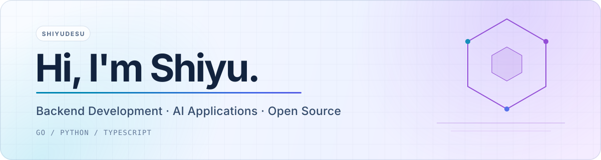

<picture>
  <source media="(prefers-color-scheme: dark)" srcset="./assets/banner-dark.svg">
  <source media="(prefers-color-scheme: light)" srcset="./assets/banner-light.svg">
  
</picture>

  
  
  
  
  
  
  

## About me

I'm a student at **Southeast University** who enjoys turning ambitious ideas into systems that can actually be run, tested, observed, and deployed.

My work sits at the intersection of **backend engineering**, **AI applications**, and **developer infrastructure**. I care about clear system boundaries, reliable asynchronous workflows, useful observability, and documentation that lets other people understand the code.

## Selected work

<table>
  <tr>
    <td width="50%" valign="top">
      <h3><a href="https://github.com/shiyudesu/frux">Frux</a></h3>
      
A production-oriented short-video feed system covering upload, media processing, moderation, recommendation, social interaction, observability, and deployment.

      
<code>Go</code> <code>React</code> <code>PostgreSQL</code> <code>Redis</code> <code>Kafka</code> <code>FFmpeg</code>

    </td>
    <td width="50%" valign="top">
      <h3><a href="https://github.com/shiyudesu/interview-guide">InterviewGuide</a></h3>
      
A self-hosted AI interview platform with resume analysis, text and voice interviews, RAG knowledge bases, scheduling, and user-managed model providers.

      
<code>Python</code> <code>FastAPI</code> <code>React</code> <code>pgvector</code> <code>Redis Streams</code>

    </td>
  </tr>
  <tr>
    <td width="50%" valign="top">
      <h3><a href="https://github.com/shiyudesu/wirewolf">WireWolf</a></h3>
      
A multi-agent Werewolf simulation platform with role-aware strategies, automated evaluation, strategy evolution, replay analysis, and real-time spectating.

      
<code>AI Agents</code> <code>FastAPI</code> <code>PostgreSQL</code> <code>WebSocket</code> <code>React</code>

    </td>
    <td width="50%" valign="top">
      <h3><a href="https://github.com/shiyudesu/Vocalendar">Vocalendar</a></h3>
      
A voice-first calendar for natural-language scheduling, real-time synchronization, and shared behavior across web and mobile clients.

      
<code>TypeScript</code> <code>Hono</code> <code>React</code> <code>Redis</code> <code>Capacitor</code>

    </td>
  </tr>
</table>

## What I like building

- Backend services with deliberate data, cache, event, and failure semantics
- AI products where evaluation and workflow design matter as much as the model call
- Reproducible local and production environments with tests, CI, containers, and observability
- Documentation and tooling that make complex repositories easier to operate

## Currently exploring

- Reliable event-driven architectures and media-processing pipelines
- Multi-agent evaluation, reflection, and regression protection
- Practical ways to ship AI features without weakening security or operability

  Building useful systems, one well-defined boundary at a time.

